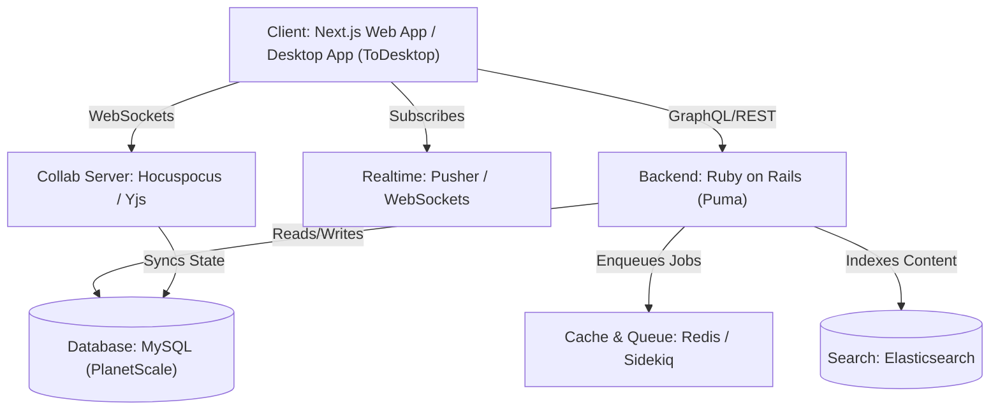

# Campsite Learning & Technology Transition Guide

This guide details the engineering competencies, technologies, and architecture patterns you will master by analyzing the Campsite codebase, and provides a direct migration map to convert the Ruby on Rails backend to **Bun + TypeScript (TS) / Next.js / Express.js**.

---

## 1. Target Level & Core Outputs

By fully understanding this codebase, you will achieve the level of a **Senior Full-Stack Engineer / Lead Architect** with specialization in **Real-time Collaborative Systems, High-Performance Monorepos, and Scale Architecture**.

### Key Outputs (What You Will Become Able to Build):
* **Real-time Multi-user Collaboration Tools:** Build Google Docs-style real-time rich editors with conflict-free replication (CRDTs).
* **Distributed Monorepos at Scale:** Manage unified codebases hosting web apps, desktop apps, third-party integrations, and automated pipelines.
* **Highly Concurrent Asynchronous Processors:** Architect background queues for transcoding audio/video, generating AI transcripts, and processing webhooks.
* **Enterprise Security & Auth Layers:** Implement secure multi-factor authentication (2FA) and OAuth2 identity provider systems.

---

## 2. Campsite Technical Architecture

---

## 3. Technology Map: Rails to Bun + TypeScript (TS)

Use this precise translation map to rebuild the Ruby on Rails backend in a modern **Bun/TypeScript** ecosystem:

| Rails Layer / Gem | Feature / Purpose | Recommended TS / Bun / Next.js Equivalent |
| :--- | :--- | :--- |
| **Rails (Puma)** | Web API Framework | **Bun + Elysia** (High performance) or **Hono / Express.js** |
| **Devise / Devise-Two-Factor** | Auth & Two-Factor Authentication | **Lucia Auth** or custom jose/bcrypt logic |
| **Doorkeeper** | OAuth2 Provider (Integrations) | **@oslojs/oauth** or custom OAuth2 routes |
| **Active Record + Trilogy** | ORM & PlanetScale MySQL adapter | **Drizzle ORM** (highly performant) or **Prisma** + `mysql2` |
| **Sidekiq + Redis** | Background Queue | **BullMQ** + Redis (robust) or native Bun queue |
| **Sidekiq-Scheduler** | Cron / Scheduled Jobs | **BullMQ Repeatable Jobs** or **Inngest** |
| **Searchkick + Elasticsearch**| Search & Indexing | **Elasticsearch Node SDK** or **Meilisearch** |
| **Pundit** | Authorization Policies (RBAC/ABAC)| **CASL** or route-level custom TS middleware |
| **Pusher** | Real-time Socket Event Signaling | **Pusher JS Node** or native **Bun.serve WebSockets** |
| **Active Storage + S3** | Cloud Media Uploads | **@aws-sdk/client-s3** + presigned URLs |
| **Streamio-ffmpeg** | Audio/Video Transcoding | **fluent-ffmpeg** (running in Node/Bun runtime) |
| **Postmark-rails + Premailer**| Rich HTML Transactional Emails | **Resend** or **Nodemailer** + **React Email** |
| **Rack Attack** | Rate Limiting & Filtering | **express-rate-limit** or **Elysia rate-limit** plugin |
| **Discard** | Soft Deletions | **Prisma/Drizzle soft-delete middleware** |
| **Acts_as_list / Friendly_id**| Sequencing & Slug Generation | **custom schema slug generation hooks** (Zod/Drizzle) |

---

## 4. Frontend & Collaboration Stack (Mastery Areas)

You will study the following production-grade React patterns within the `/apps/web` and `/packages` directories:

* **State Management:** Fine-grained atomic UI state using **Jotai** coupled with server state synchronization using **TanStack React Query**.
* **CRDT Collaboration:** Real-time cooperative document editing utilizing **Yjs** & **Tiptap** synchronized via **Hocuspocus**.
* **Media & Audio:** Live video calls and audio processing utilizing **100ms Live React SDK**.
* **Animation & Polish:** Fluid micro-interactions styled via **Tailwind CSS** and powered by **Framer Motion**.
* **Monorepo Build Pipelines:** Workspace builds optimized via **pnpm** and execution caching via **Turborepo**.

> [!TIP]
> **Recommended Transition Strategy:**
> When converting the Ruby backend to Bun + TS, do not rewrite everything at once. Keep the `/apps/web` Next.js frontend intact, and build the Bun API incrementally. You can use standard reverse proxies or Next.js rewrites to direct API paths from the Rails backend to the new Bun service one resource at a time.
